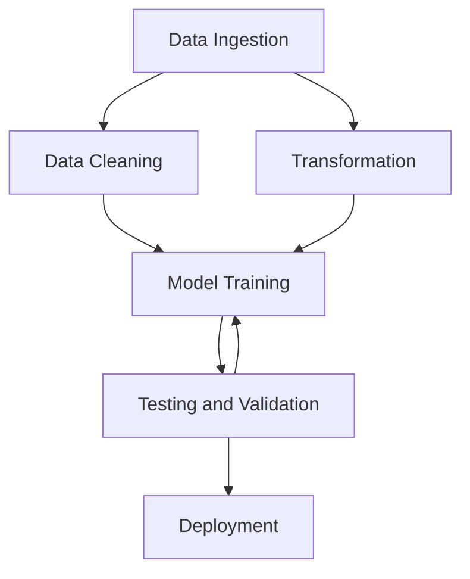

#udacity

Start with the problem, not the data

This is the usual path, but not the best...

We actually need to start with the busines part, not the data:
![[Captura de Pantalla 2020-12-08 a la(s) 9.54.36.png]]

### Sequence
- Start with the busines problem
- Continue with the data problem
- Move to model building =>
	- Feature extraction
- Deployment =>
	- Deploy the model to realize its busines value
	- Migration, version control
	- Deploy for narrow and measurable articulations of the given goal
		- Be clear with the goals => only for targered use cases

Start with the problem not the data
Procduction systems actively learn

What is a good problem for AI?

### Project statement
- what problem are we solving?
- how does AI add value?
- what data are needed?
- scope?
- how do we measure success?

### Metrics
- How to measure success
- What najes a netric effective?
	- Easily measurable
	- Directly correlated to business performance
	- Predictive of future business outcomes
	- Isolated to factors controlled by the group it's measuring
	- Comparable to competitor's metrics

### Need for deep learning vs traditional machine learning
- Deep learning outperforms with large datasets. ML will work best for smallest datasets
- Deep learning techniques will require more powerful infrastructure.
- Deep learning is about learning features rather than manually engineering them
- Deep learning works well with unstructured data

![[Captura de Pantalla 2020-12-08 a la(s) 13.35.33.png]]

### Team Overview
- Cross-fucntional teams are critical for driving business outcomes

### Key roles
- **Product Owner**
	- Business case owner
	- Bridges frim stakeholders to team
	- Owns maximization of product value
	- Ensures that the team builds the right product

- **Designer**
	- Owns human-computer interaction design
	- Visual design, information architecture, interaction design
	- Useability and accessibility

- **Softwar Enginner**
	- Builds product infrastructure
	- Problem solver in sofware development
	- Frontend/Backend

- **Data Engineer**
	- Builds data infrastructure
	- Gets model into production
	- Ensures entire pipeline can support rapit development and intraction after launch
	- Model management
	- A/B testing and validation

- **Data Scientist**
	- Builds ands selects models
	- guides the team on the state-of-the art technoogy
	- Structures the problem to achive the business metrics
	- Uses data to answer business questions

- **Quality Assurance**
	- Owns quality assurance of the product
	- Ensures product release is ready
	- Sclability testing 
	- Functional testing

- **Development and Operations**
	- Ensures infrasturcture and reliability
	- Manages scalability and performance

## Scrum
#scrum => is a framework for prototyping and improving on product ideas.
![[https://www.atlassian.com/agile/scrum]]
![[Captura de Pantalla 2020-12-08 a la(s) 14.14.14.png]]

## Summary:
- Start with the business problem
- Make sure you have the right data
- Build and interdisciplinary team
- Learn and iterate... fast